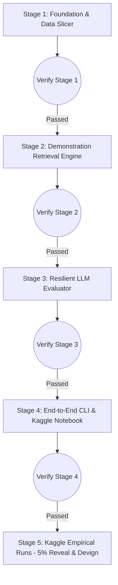

# Kế Hoạch Tái Cấu Trúc & Triển Khai GRACE Theo Giai Đoạn (v1.0.0)

Bản kế hoạch này chia nhỏ toàn bộ quá trình tái cấu trúc, sửa lỗi và tối ưu hóa hệ thống GRACE thành **5 Giai đoạn (Stages) tuần tự**. 

Mỗi giai đoạn đều được thiết kế độc lập, đóng góp một phần kiến trúc rõ ràng và **bắt buộc phải đi qua bước kiểm chứng nghiệm thu (Milestone Checkpoint)** trước khi cho phép tiến lên giai đoạn tiếp theo.

---

## 1. Mục Tiêu & Nguyên Tắc Kỹ Thuật (Overview & Engineering Principles)

1. **Thẩm định Từng bước (Verify Early & Often):** Không xây dựng dồn ứ. Sau mỗi Giai đoạn (Stage), viết script kiểm thử tự động (`tests/test_stageX.py`) để chạy xác nhận mã nguồn hoạt động chính xác 100% trước khi bước tiếp.
2. **Loại bỏ Hoàn toàn Mã nguồn Khuyết tật:** Xóa bỏ sự phụ thuộc vào các file cũ hỏng hóc (`genexample.py`, `util.py`, lỗi hardcode đường dẫn ổ `F:/` của tác giả gốc).
3. **Tối ưu Tinh gọn cho Kaggle:** Viết mã thuần thục cho môi trường Kaggle (tận dụng GPU PyTorch cho CodeT5, cơ chế nạp Kaggle Secrets an toàn cho API Key, lưu điểm neo Checkpoint thời gian thực tránh timeout).
4. **Hỗ trợ Chạy thử nghiệm Nhanh (5% Slicing):** Đưa tính năng cắt mẩu dataset theo tỷ lệ (ví dụ 5%) vào tầng cốt lõi để test trơn tru quy trình thực nghiệm với Reveal và Devign trước khi tốn thời gian và ngân sách cho 100% tập dữ liệu.

---

## 2. Câu Hỏi Cần Làm Rõ & Đánh Giá Giải Pháp (Evaluated Decisions & Answers)

> [!IMPORTANT]
> **1. Quyết định Nguồn Dữ liệu (Dataset Source):**
> - **Lựa chọn chính thức**: **Sử dụng các Bộ Dữ liệu Chuẩn trên Hugging Face** (`DetectVul/devign`, `bstee615/bigvul`, v.v.).
> - **Định hướng kỹ thuật**: Tập trung tái tạo và cải tiến các **kỹ thuật & phương pháp luận cốt lõi** của bài báo GRACE (Graph structure + In-context learning + LLM evaluation). Tải tự động qua thư viện `datasets` của Hugging Face giúp mã nguồn hiện đại, sạch sẽ và dễ tùy biến mở rộng.

> [!IMPORTANT]
> **2. Quyết định Mô hình LLM & Tối ưu Chi phí cho Kaggle:**
> - **Lựa chọn chính thức**: **Chạy trực tiếp Mô hình Open-Weights trên Kaggle GPU T4 (`Qwen2.5-Coder-7B-Instruct` hoặc `DeepSeek-Coder-6.7B`) với kỹ thuật 4-bit Quantization (`bitsandbytes`)**.
> - **Ưu điểm vượt trội**:
>   1. **100% MIỄN PHÍ**: 0$ chi phí API, tận dụng 30 giờ/tuần GPU T4 miễn phí của Kaggle.
>   2. **KHÔNG RATE LIMIT**: Khắc phục hoàn toàn nhược điểm nghẽn 15 requests/phút của các API miễn phí như Gemini. Cho phép chạy batch processing liên tục với tốc độ cao.
>   3. **HIỆU NĂNG SOTA**: `Qwen2.5-Coder-7B-Instruct` là mô hình mã nguồn mở hàng đầu hiện nay, vượt trội hơn GPT-3.5-Turbo về tư duy code và phân tích lỗ hổng.
> - **Phương án dự phòng**: Giữ lại adapter gọi API giá rẻ (`DeepSeek API` / `OpenAI GPT-4o-mini`) nếu người dùng muốn so sánh kết quả.


---

## 3. Lộ Trình Triển Khai 5 Giai Đoạn (Proposed Stage-by-Stage Architecture)



### Stage 1: Foundation, Data Loader & Kaggle Compatibility
Tạo mấu chốt cấu hình toàn cục và bộ giải quyết I/O dữ liệu đa môi trường (Local / Kaggle), hỗ trợ bóc tách mẩu dữ liệu thử nghiệm 5%.

- **File mới `config.py`**:
  - Nhận diện môi trường động (`/kaggle/working`, `/kaggle/input` vs Local).
  - Tiện ích đọc OpenAI API Key từ biến môi trường hoặc `kaggle_secrets`.
- **File mới `data_loader.py`**:
  - Tải tập dữ liệu Devign và Reveal, kiểm tra chuẩn hóa các trường tiêu chuẩn (`func`, `node`, `edge`, `target`).
  - Hàm `slice_dataset(data, ratio=0.05, seed=42)`: Trích xuất 5% dữ liệu ngẫu nhiên cân bằng tỷ lệ nhãn Vulnerable/Non-vulnerable.

---

### Stage 2: Demonstration Retrieval Engine (Thay thế hoàn toàn `genexample.py`)
Xây dựng lại bộ tìm kiếm và sắp xếp ví dụ mẫu (In-context demonstration) khớp 100% với lý thuyết toán học trong bài báo GRACE, loại bỏ toàn bộ lỗi cũ từ các bài toán không liên quan.

- **File mới `retrieval_engine.py`**:
  - **Tạo Vector nhúng (CodeT5 Embedding):** Dùng `Salesforce/codet5-base`, tăng tốc batch transfer trên GPU PyTorch Kaggle.
  - **Tìm kiếm Nearest Neighbors:** Trực tiếp sử dụng tính toán ma trận khoảng cách $L_2$ trên bộ nhớ GPU của PyTorch/Scipy, trích siêu nhanh $K=5$ ứng viên mẫu gần nhất.
  - **Cơ chế Rerank kép (Hybrid Reranking):**
    $$\text{Score} = 0.7 \times \text{Jaccard}(Code_{test}, Code_{train}) + 0.3 \times \text{Sim}(Graph_{test}, Graph_{train})$$
  - Tự động đính kèm đoạn code mẫu có Score cao nhất vào trường `example` cho từng đối tượng test.

---

### Stage 3: Resilient LLM Evaluator & Robust Prompting (Thay thế `llmpre.py` & `basep.py`)
Cải tiến trọn bộ hệ thống gọi LLM, giải quyết nhược điểm dễ gián đoạn trên Kaggle và thiết lập kết cấu Prompt chuẩn xác.

- **File mới `prompt_engine.py`**:
  - Lắp ráp Prompt theo kiến trúc chuẩn xác của **Hình 6 trong bài báo**:
    1. System & Role: Setup vai trò chuyên gia rà soát lỗ hổng bảo mật C/C++.
    2. In-Context Demonstration: Đưa đoạn code và thông tin Node/Edge mẫu của Stage 2 vào.
    3. Target Code & Graphs: Thông tin hàm C/C++, cấu trúc Node (AST/PDG) và Edge (CFG/Data Flow) cần phân tích.
    4. Strict Constraint: Buộc mô hình trả lời tập trung vào nhãn `"1"` (Vulnerable) hoặc `"0"` (Non-vulnerable).
  - Hỗ trợ chế độ `--mode base`: Chỉ gửi prompt cơ bản (không dùng Graph và Example) để so sánh hiệu quả.

- **File mới `evaluator.py` & `metrics.py`**:
  - Nâng cấp trích xuất API qua client hiện đại `openai>=1.0.0`.
  - **Cơ chế Phục hồi Tự động (Checkpointing & Retry):**
    - Tránh rủi ro lỗi mất mạng, Rate limit nhờ logic Retry + Exponential Backoff.
    - Kết quả lưu lập tức vào `checkpoints.jsonl`. Nếu Kaggle sập hay timeout (9 tiếng), lệnh khởi chạy sau sẽ đọc checkpoint để **chạy nối tiếp ngay tại vị trí văng**.
  - **Hệ thống trích lọc đáp án thô (Regex Parsing):** Tách con số `0` hoặc `1` kiên cố từ mọi dạng chuỗi kết quả của LLM.
  - Tự động báo cáo `Accuracy`, `Precision`, `Recall`, `F1-Score`.

---

### Stage 4: End-to-End Orchestration & Kaggle Notebook Ready
Hợp nhất các mô-đun riêng lẻ ở các giai đoạn trước thành một đầu mối vận hành mạch lạc, đi kèm Notebook ăn liền cho Kaggle.

- **File mới `run_pipeline.py`**:
  - Cổng điều khiển CLI kết nối trọn gói: Data Loader -> Retrieval Engine -> Prompt Build -> Evaluator -> Metrics Report.
  - Cú pháp chạy:
    ```bash
    python run_pipeline.py --dataset reveal --sample_ratio 0.05 --mode grace --gpu --checkpoint_dir /kaggle/working/ckpt
    ```

- **File mới `GRACE_Kaggle_Reproduce.ipynb` & `requirements.txt`**:
  - Notebook phân chia Cell rõ ràng (cài đặt `transformers`, `torch`, `openai`, `scikit-learn`, nạp Secrets, chạy 5% dataset Reveal / Devign).

---

### Stage 5: Chạy Thực nghiệm trên Kaggle (Reveal & Devign 5% -> Full)
- Khởi chạy Thí nghiệm Nhanh (Warm-up 5% Reveal & Devign).
- Kiểm soát lưu lượng Token, thời gian GPU và tính ổn định của Checkpoint.
- Đối chiếu Baseline (`--mode base`) vs GRACE (`--mode grace`) trên F1-Score.

---

## 4. Phương Án Kiểm Thử & Nghiệm Thu (Verification Plan & Checkpoints)

| Giai đoạn | Lệnh / Script Kiểm thử | Tiêu chí Nghiệm thu (Milestone Checkpoint) |
| :--- | :--- | :--- |
| **Stage 1** | `python -m pytest tests/test_stage1_loader.py` | Load mock file JSON, cắt nhở 5% cân bằng nhãn, tự nhận diện đúng đường dẫn Local/Kaggle. |
| **Stage 2** | `python -m pytest tests/test_stage2_retrieval.py` | CodeT5 load trơn tru trên GPU/CPU, ma trận $L_2$ + Rerank kép trả về top K mẫu chính xác không OOM. |
| **Stage 3** | `python -m pytest tests/test_stage3_eval.py` | Regex parser bóc tách được `0`/`1` từ chuỗi nhiễu; logic ghi/đọc `checkpoints.jsonl` khôi phục đúng tiến độ. |
| **Stage 4** | `python run_pipeline.py --dataset devign --sample_ratio 0.01 --dry-run` | Dry-run end-to-end thông suốt từ đọc dữ liệu đến xuất log báo cáo kết quả. |
| **Stage 5** | Chạy notebook trên Kaggle | Xuất bản biểu đồ đối chiếu F1-Score giữa Base vs GRACE và nộp báo cáo kết quả. |

---

## 5. Lưu Ý Cho AI Agent (AI Agent Directives)

1. Tuân thủ tuyệt đối quy trình **Stage-by-Stage**: Không chuyển sang Stage tiếp theo khi test checkpoint của Stage trước chưa đạt 100% PASS.
2. Mọi code Python viết ra phải có docstring, logging chi tiết và tuân thủ PEP8.
3. Luôn ưu tiên dùng đường dẫn tương đối qua `config.py`.

---

## 6. Lịch Sử Cập Nhật (Revision History)

| Ngày | Tác giả | Thay đổi chính |
| :--- | :--- | :--- |
| 2026-08-01 | Antigravity & Human | Khởi tạo kế hoạch 5 Giai đoạn chuẩn theo template `project_docs/plans/` |
